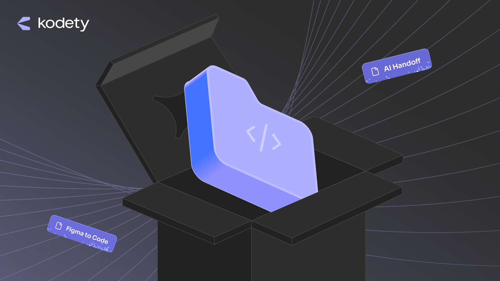

# Kodety AIDoff

**From Figma or screenshots to functional websites and web applications.**

Kodety AIDoff is an agent skill for building landing pages, company and marketing sites, portfolios, multi-page websites, applications, and dashboards. It combines design reconstruction with modular code, responsive behavior, accessibility, and evidence-based verification.

## Two ways to build

| Input | Reported visual fidelity | Workflow |
| --- | --- | --- |
| **Figma link, with or without a screenshot** | **90%-99%** | Read node-specific design context, preserve authored structure and measurements, and retrieve the original exported icons and assets. Verify the running implementation separately. |
| **Screenshot alone** | **75%-90%** | Rebuild the visible interface without requiring Figma access. Record inferred typography, spacing, behavior, and responsive rules. Prefer exact assets; use genuine Keyline Icons only for unrecoverable UI glyphs. |

These typical ranges are the maintainer's informal visual assessments using **OpenAI Astra with Medium reasoning effort or higher**, not an independently validated benchmark, measured average, guarantee, or pixel-comparison score. Results depend on source access, quality, fonts, assets, model, and settings; do not assume the same ranges for other models or hosts. The Figma range requires access to the linked design and its context. Substitutions remain documented; logos require authentic assets.

## What the workflow emphasizes

- Focused components and cohesive modules, readable code, and minimal nonessential comments.
- Custom design-system controls, including select triggers, dropdown panels, and options. Focus outlines are reserved for actual text-entry fields; other controls retain visible keyboard focus through design-system styling without outlines or rings.
- Performance decisions based on real workloads, including justified memoization, bounded data rendering, and resource cleanup.
- Working navigation and controls, with honest boundaries for missing integrations. Static websites do not need invented authentication or backends.
- An automatically opened development preview as soon as the first meaningful screen renders, when the host provides browser/preview access.
- A small, truthful development progress indicator that disappears immediately when work finishes and is excluded from production and fidelity captures.
- Separate visual, functional, and production checks, followed by a concise handoff. Publication happens only when requested.

## Install in Codex

Choose one scope. These commands use the local skill locations documented by OpenAI. [Official Codex skill documentation](https://learn.chatgpt.com/docs/build-skills#where-codex-loads-local-skills)

**Personal — available across your projects:**

```sh
mkdir -p "$HOME/.agents/skills"
git clone https://github.com/matusaelhorch/kodety-aidoff.git "$HOME/.agents/skills/kodety-aidoff"
```

**Project — run from your project's root instead:**

```sh
mkdir -p .agents/skills
git clone https://github.com/matusaelhorch/kodety-aidoff.git .agents/skills/kodety-aidoff
```

In Codex CLI or the IDE extension, mention the skill with `$kodety-aidoff` or select it through `/skills`. If it does not appear, restart Codex. [Invocation and discovery](https://learn.chatgpt.com/docs/build-skills#how-codex-uses-skills)

```text
$kodety-aidoff Recreate the attached screenshot as a responsive landing page in this repository.
```

## Install in Claude Code

Choose one scope using Claude Code's documented skill directories. [Official Claude Code skill documentation](https://code.claude.com/docs/en/skills#choose-where-skills-load)

**Personal — available across your local projects:**

```sh
mkdir -p "$HOME/.claude/skills"
git clone https://github.com/matusaelhorch/kodety-aidoff.git "$HOME/.claude/skills/kodety-aidoff"
```

**Project — run from your project's root instead:**

```sh
mkdir -p .claude/skills
git clone https://github.com/matusaelhorch/kodety-aidoff.git .claude/skills/kodety-aidoff
```

Invoke the skill with `/kodety-aidoff`. Restart Claude Code if you created a top-level skills directory after the session began. [Invocation and live detection](https://code.claude.com/docs/en/skills)

```text
/kodety-aidoff Build a responsive portfolio from the attached screenshots in this repository.
```

The shell commands above work in macOS/Linux shells and Git Bash. `git clone` refuses an existing nonempty destination; it does not overwrite an installed copy. Keep your existing installation if that happens.

### Claude web and Desktop

1. Download [kodety-aidoff.zip](https://github.com/matusaelhorch/kodety-aidoff/releases/latest/download/kodety-aidoff.zip) from the latest release.
2. Keep the ZIP intact. It contains `kodety-aidoff/SKILL.md` and its supporting files inside the required top-level folder. [Packaging requirements](https://support.claude.com/en/articles/12512198-how-to-create-custom-skills)
3. Enable **Code execution and file creation**. Open **Customize → Skills → + → Create skill → Upload a skill**, upload your ZIP, and enable the skill. Organization policies may control availability. [Official upload instructions](https://support.claude.com/en/articles/12512180-use-skills-in-claude)

Customize is available in Claude Desktop as well as on the web. Ask, for example: “Use Kodety AIDoff to recreate this screenshot as a responsive website.” [Desktop customization](https://support.claude.com/en/articles/14328846-browse-skills-connectors-and-plugins-in-one-directory)

Chat-hosted execution and previews differ from a local coding session. An upload does not provide access to your local repository, localhost, or Figma automatically; use the tools and connections available in that environment.

## Requirements and portability

- **Local tooling:** Git for installation, a maintained Node.js release for the bundled scripts, and Python 3 with Pillow for screenshot source checks, comparison, and the full self-test. Set `FIGMA_APP_PYTHON` to a specific Python interpreter when needed.
- **Project access:** an agent able to read and edit files, run the project's commands, inspect images, and use a browser or preview. The target project's own runtime and dependencies still apply.
- **Optional capture helper:** `scripts/capture-route.mjs` uses Playwright installed in the target project; other browser tooling can follow the same evidence contract.
- **Figma mode:** access to the source file and a compatible Figma connection providing node-specific design context, screenshots, and exact asset extraction. Use the companion `figma-design-to-code` workflow when available, or the equivalent workflow supported by your host. The connection and companion skills are not bundled here.
- **Host compatibility:** tool names, parameters, motion extraction, and browser capabilities vary. Use the actual tool schema; `skillNames` applies only when that parameter is supported. Installation follows each host's documented skill format, but does not constitute end-to-end runtime testing across hosts.

Screenshot-only reconstruction does not need Figma tooling. Genuine Keyline assets and any required fonts or third-party media must be available separately; they are not included in this repository.

## Validate

Run from the installed skill directory, with Node.js and Python/Pillow available:

```sh
node scripts/self-test.mjs
```

Validate an implementation and its evidence map:

```sh
node scripts/validate-figma-app.mjs /absolute/path/to/project --require-map
```

Compare equal-size local screenshots:

```sh
python3 scripts/compare-screenshots.py reference.png actual.png --output-dir comparison
```

The validator checks structure and recorded evidence; it does not replace browser interaction or human visual review. See [the skill](SKILL.md), [the implementation map](references/implementation-map.md), and [the visual fidelity contract](references/visual-fidelity.md) for the complete workflow.

## License and attribution

Copyright © 2026 **Kodety / matusaelhorch**. This repository is licensed under
**Creative Commons Attribution-ShareAlike 4.0 International (CC BY-SA 4.0)**.
See [LICENSE](LICENSE) and the [official license summary](https://creativecommons.org/licenses/by-sa/4.0/).

When sharing the skill or a modified version, credit the original creator,
link to the original repository and license, and indicate your changes.
Distributed adaptations must use CC BY-SA 4.0 or a compatible license, as
specified in the legal terms. Attribution must not imply endorsement.

Example attribution for an adaptation:

> Based on [Kodety AIDoff](https://github.com/matusaelhorch/kodety-aidoff)
> by Kodety / matusaelhorch, licensed under
> [CC BY-SA 4.0](https://creativecommons.org/licenses/by-sa/4.0/).
> Changes: describe your modifications here.
